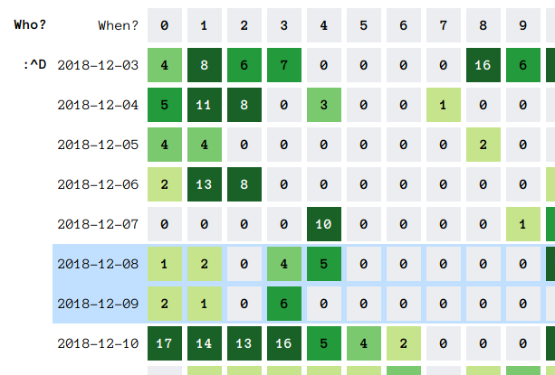

# Stalky

This is a fork of the original [Stalky](https://github.com/defaultnamehere/zzzzz) that now requires Python 3.6 or newer,
but the fetcher itself does not require Requests, Certifi, etc.

The fetcher can be run on OpenWRT routers with python3-light (hint hint). Instead of the Flask app, you can just run the
local `python3 -m http.server` in this directory and off you go.

[The blog post](https://defaultnamehere.tumblr.com/post/139351766005/graphing-when-your-facebook-friends-are-awake) and
the original repo explains what it does and how to run it, but you'll have to supply config/credentials by creating a
`config.py` file with the following contents (instead of SECRETS.txt):

```python
STALKER_UID = '100000000000000'  # Your Facebook UID.
STALKER_CLIENTID = '66f4cff'  # Your FB clientid (inspect GET params to /pull in your browser's devtools to find this)
STALKER_COOKIE = 'your=fb_cookies; in=curl_format that_you_can_get=in_browser_devtools; tab=network_requests; rclick=copy_as_curl;'
STALKED_LIST = [
    '100000000000000', # List of all UIDs you want to stalk (all as strings).
    '100000000000001', # This is the kind of shit someone ends up doing with
    '100000000000002', # when your roommate keeps talking on the damn phone
    '100000000000003'  # til 3am and attempts (poorly) to deny the fact.
]
```

## Drawing Heatmaps

After running the fetcher for a while, you'll end up with files containing hundreds of timestamps. I ran the fetcher on
a remote machine running 24/7 and periodically ran `pull.sh` to grab the logs to my local machine, then after I was done
collecting data, used `merge.sh` to glue together all the logs and leave only unique timestamps in the log files.

Then, I've renamed the resultant merged logs into FirstLastName.log, moved them next to `generator.py` and ran that to
get `generated.html` which contains a heatmap, like this one:



Blue row background marks weekends. The count in each square is the amount of timestamps collected for that hour - in
theory, the larger the timestamp count, the more active a given user was that hour on Facebook or related services.
